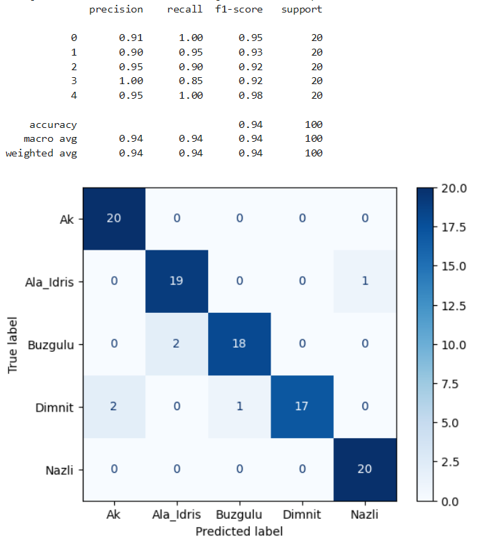
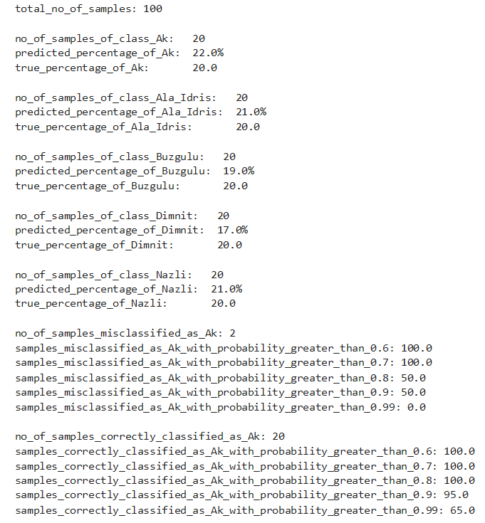
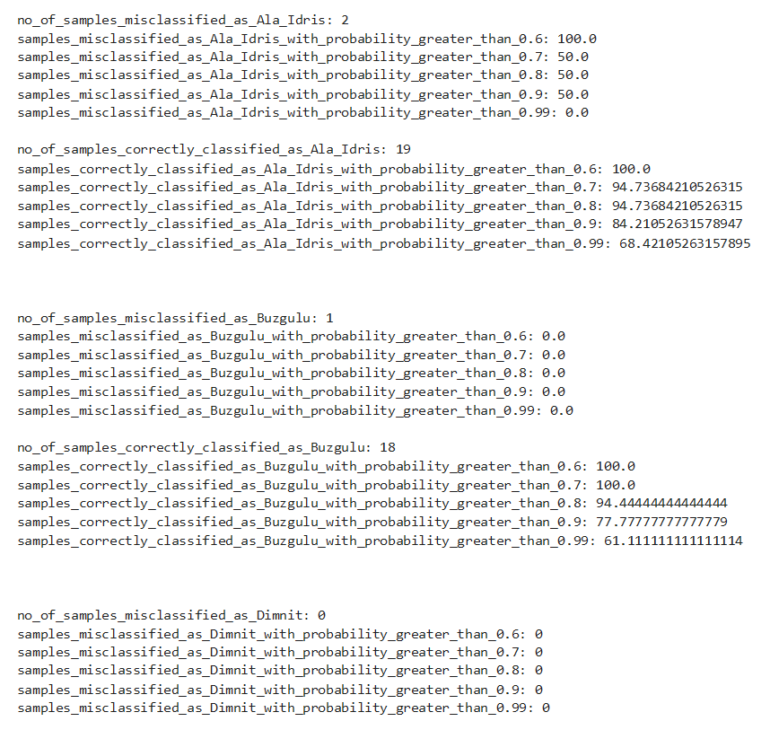
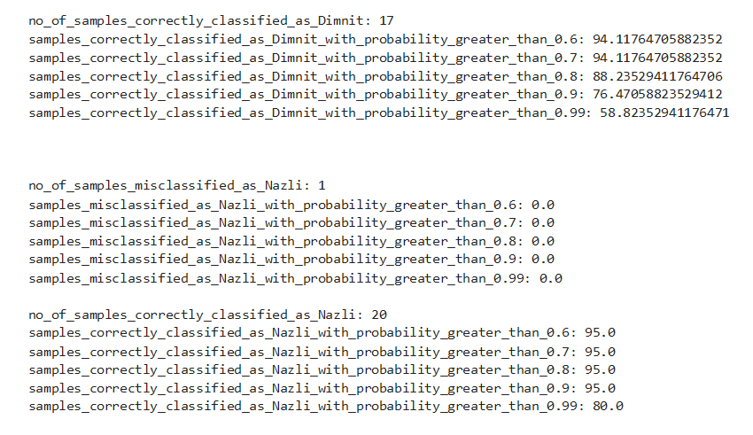

# Classifying-Grapevine-Varieties-Using-images-of-Grapevine-Leaves 

### I have tried to classify Grapevine varieties using images of leaves of different varieties of Grapevine

## [Based on Kaggle Dataset](https://www.kaggle.com/datasets/muratkokludataset/grapevine-leaves-image-dataset/data)

### Motivation:
Grapevines produce grapes, which are enjoyed fresh or used in various processed products. Additionally, grapevine leaves are harvested annually as a by-product. The specific species of grapevine leaves play a crucial role in determining both their price and taste.
Deep learning-based classification to analyze images of grapevine leaves. We focused on 500 vine leaves from 5 different species, captured using a specialized self-illuminating system. This innovative approach aims to enhance our understanding of grapevine leaf characteristics for improved classification and potential applications in the agricultural automation.

# Table of Contents [grapevine_leaves_classification.ipynb](grapevine_leaves_classification.ipynb)

## 1. Importing data
   - ##### Importing data from kaggle
   - ##### Unzipping the data

## 2. Data Cleaning
   - ##### Addressing Class Imbalance

## 3. Data Transfer
   - ##### Creating relevant directories & transferring the data (train, test and validation splits)

## 4. Data Augmentation & Processing
   - ##### Setting up generators to Augment & Process the data

## 5. Data Visualisation
   - ##### Visualizing typical images in the data before & after Augmentation

## 6. Setting up a baseline performance
   - #####  Using a small convnet, setting up a baseline performance

## 7. Transfer Learning
 - ### Feature Extracton With Data Augmentation
   - ##### Freezing Convolutional Base
   - ##### Adding the Classifier Base
   - ##### Setting Up Callbacks
   - ##### Compiling & Training The Model
   - ##### Selecting the best set of weights by comparing the performance on Training, Validation & Test Datasets
   - ##### Generating Classification Report and Confusion Matrix on Test Dataset

 - ### Fine Tuning
   - ##### Unfreezing last two layers of Convolutional Base
   - ##### Adding the Classifier Base
   - ##### Setting Up Callbacks
   - ##### Compiling & Training The Model
   - ##### Selecting the best set of weights by comparing the performance on Training, Validation & Test Datasets
   - ##### Generating Classification Report and Confusion Matrix on Test Dataset

## 8. Conclusions

### Results
The results were:
- For objects correctly_classified as Quasars, 90.3% of them had a probability greater than 0.9 of being a Quasar.
- For objects correctly_classified as Galaxies, 86.7% of them had a probability greater than 0.9 of being a Galaxy.
- For objects correctly_classified as Stars, 99.6% of them had a probability greater than 0.9 of being a Star.
### Screenshots from the notebook [production.ipynb](production/production.ipynb):

### Skills demonstarted:

(pandas, numpy, tensorflow/keras, scikit-learn & matplotlib)

